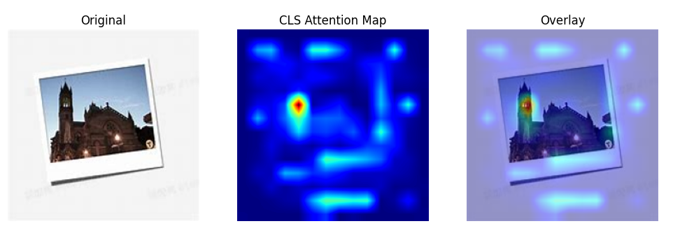

# Image Feature Extraction

## 介绍

基于香橙派AIPro边缘计算硬件的低功耗、高算力特性，结合MindSpore开源框架的灵活部署能力以及Vision Transformer模型的强大能力，实现的一款可以实现Image Feature Extraction的应用。
Vision Transformer（ViT）是2020年由Google Research提出的​​首个将Transformer架构成功应用于图像识别任务的模型​​，彻底打破了传统卷积神经网络（CNN）在计算机视觉领域的主导地位，开启了视觉与语言模型融合的新纪元。本应用选取的模型为`google/vit-base-patch16-224`，其中的patch16代表每个patch块的大小为`16*16`，224则代表模型期望输入的图像为`224*224`的。

### 环境准备

开发者拿到香橙派开发板后，首先需要进行硬件资源确认，镜像烧录及CANN和MindSpore版本的升级，才可运行该案例，具体如下：

开发板：香橙派Aipro或其他同硬件开发板  
开发板镜像: Ubuntu镜像  
`CANN Toolkit/Kernels：8.0.0.beta1`  
`MindSpore: 2.6.0`  
`MindNLP: 0.4.1`  
`Python: 3.9`

#### 镜像烧录

运行该案例需要烧录香橙派官网ubuntu镜像，烧录流程参考[昇思MindSpore官网--香橙派开发专区--环境搭建指南--镜像烧录](https://www.mindspore.cn/tutorials/zh-CN/r2.7.0rc1/orange_pi/environment_setup.html) 章节。

#### CANN升级

CANN升级参考[昇思MindSpore官网--香橙派开发专区--环境搭建指南--CANN升级](https://www.mindspore.cn/tutorials/zh-CN/r2.7.0rc1/orange_pi/environment_setup.html)章节。

#### MindSpore升级

MindSpore升级参考[昇思MindSpore官网--香橙派开发专区--环境搭建指南--MindSpore升级](https://www.mindspore.cn/tutorials/zh-CN/r2.7.0rc1/orange_pi/environment_setup.html)章节。

### requirements.txt
```
Python == 3.9

MindSpore == 2.6.0

mindnlp == 0.4.1

sympy==1.14.0

pillow

opencv-python

matplotlib
```
## 快速使用

用户在准备好上述环境之后，直接运行`image_feature_extraction.ipynb`文件即可，代码中使用的vit模型会自动从`huggingface`镜像中下载。
运行程序后需要输入图像路径，模型会输出图像特征的维度、图像特征的前10维示例、图像特征的Attention map；  
输入`exit`终止程序

## 预期输出

用户:  /opt/image2text/test.jpg  
patch_size个数:  14  
  
Embedding shape:  (1, 768)  
前10维特征:  [-1.1446282   0.4479444  -0.9698104  -0.1089362   0.07386772  0.748882
  0.49805078 -0.5922615   0.30479807 -0.54076034]


